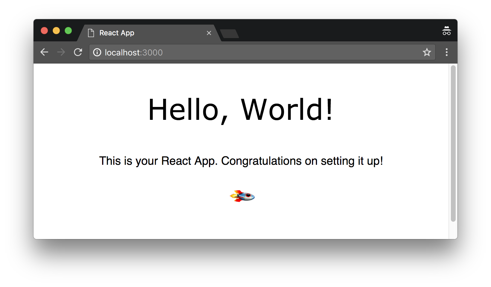

# react-minimal-boilerplate


No, I just don't want to use Create React App.

Seriously, ejecting from a project created by Create React App is a nightmare to me. What the heck are those peculiar configuration, and why are there so many dependencies that I've never heard of? Do I really need them installed for me?

In addition, `we love using style.scss`. Unfortunately it needs some additional setup to get it up and running. Therefore, here I present my minimal setup for any React project.

TBH I find it awesome.



## Kickstart

1. Clone this repo

```
$ git clone https://github.com/lyming90/react-minimal-boilerplate.git
```

2. I hope you already have yarn installed on your computer. If you have, run the following command to install all dependencies.

```
$ yarn install
```

3. Run

```
$ yarn start
```

4. Build (if you want to deploy your app)

```
$ yarn build
```

## Features

- ES2015 (ES6) support
- SCSS

## What's Inside


- React 16
- Babel
- Webpack 4